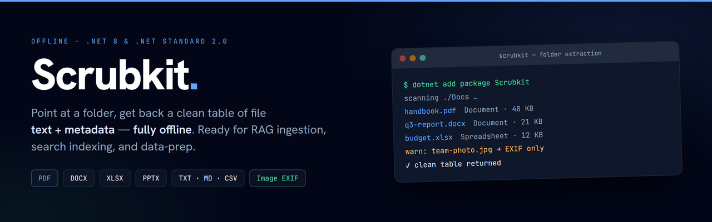
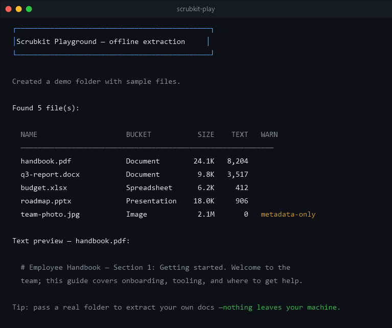

# Scrubkit



[](https://github.com/jjopensoftworks-blip/Scrubkit/actions/workflows/ci.yml)
[](https://www.nuget.org/packages/Scrubkit)
[](https://www.nuget.org/packages/Scrubkit)
[](LICENSE)

**[🌐 Website](https://jjopensoftworks-blip.github.io/Scrubkit/)** · **[📦 NuGet](https://www.nuget.org/packages/Scrubkit)** · **[📝 Changelog](CHANGELOG.md)**

**Point at a folder, get a clean table of file text + metadata back — fully offline.**
Scrubkit walks a directory and extracts text and metadata from common file types,
returning one row per file. Everything runs locally — no network calls, no telemetry —
so it's a natural first step for RAG ingestion, search indexing, and data-prep pipelines
that must stay on-device.

- **Offline.** No network calls, no telemetry — everything runs locally.
- **Fast, small core.** PDF · Office (docx/pptx/xlsx) · text · image EXIF, on
  PdfPig + MetadataExtractor only.
- **Pluggable.** Add or override formats via `IFileExtractor`; opt into text transforms
  (e.g. redaction) via an `IRedactor` you supply. Ship add-ons that reference only
  `Scrubkit.Abstractions`, keeping heavy dependencies out of the core.
- **Robust.** A single unreadable file never crashes the batch — problems surface as
  `Warnings` on the row.
- **Scrub before AI/sharing.** Opt-in redaction of PII **and secrets** (API keys, JWTs,
  private keys, connection strings), a `Chunker` for RAG, and CSV / JSON / **JSON Lines** /
  Parquet output.
- **Runs from a shell.** The [`scrubkit`](https://www.nuget.org/packages/Scrubkit.Tool) CLI
  (`dotnet tool install -g Scrubkit.Tool`) scans a folder with zero code.



## Install

```sh
dotnet add package Scrubkit
```

## Quick start

```csharp
using Scrubkit;

var scrubber = new FolderScrubber(new ReadOptions { Recursion = Recursion.AllNested });
IReadOnlyList<FileRecord> table = await scrubber.ReadAsync(@"C:\Docs");
```

See [`src/Scrubkit/README.md`](src/Scrubkit/README.md) for the full API.

## Recipe: prepare a folder for RAG

Stream a document folder straight into a vector store — text + metadata ready to embed,
rows with no text skipped:

```csharp
var scrubber = new FolderScrubber(new ReadOptions
{
    MaxTextLength = 8_000,   // keep chunks index-friendly
});

var chunker = new Chunker();   // overlapping windows, whitespace-snapped

await foreach (var doc in scrubber.ReadStreamAsync(@"C:\Docs"))
{
    if (doc.Text.Length == 0) continue;   // skip metadata-only rows

    foreach (var chunk in chunker.Chunk(doc))
        await index.UpsertAsync(
            id: $"{chunk.Path}#{chunk.Index}",
            text: chunk.Text,             // ready to embed
            metadata: chunk.Metadata);
}
```

## No code? Use the CLI

Install the [`scrubkit`](https://www.nuget.org/packages/Scrubkit.Tool) tool and scan a folder
straight from a shell or CI:

```sh
dotnet tool install --global Scrubkit.Tool

scrubkit scan ./docs                                          # extract → CSV on stdout
scrubkit scan ./repo --redact --format jsonl --out docs.jsonl # scrub PII + secrets → JSON Lines
scrubkit scan ./data --redact=aggressive --include .pdf,.eml  # widest net, filtered
```

The table goes to stdout (or `--out`); progress + a summary go to stderr, so it pipes cleanly.
Output formats: CSV / JSON / JSON Lines / Parquet. Exit code `0` on success, `1` on a usage /
I/O error. Full flag list: [`src/Scrubkit.Tool`](src/Scrubkit.Tool/README.md).

**In CI:** copy [`samples/github-action/scrubkit-scan.yml`](samples/github-action/scrubkit-scan.yml)
to produce a scrubbed corpus artifact, or fail a build if secrets/PII would leak.

## Try it without installing

The playground creates a demo folder of sample files and extracts them, so you can see the
output before adding the package to your project:

```sh
dotnet run --project samples/Scrubkit.Playground
```

Point it at a real folder (nothing leaves your machine):

```sh
dotnet run --project samples/Scrubkit.Playground -- "C:\Docs"
```

## Build & test

```sh
dotnet build -c Release        # builds all packages (netstandard2.0 + net8.0)
dotnet test  -c Release        # runs the test suite
```

## Repository layout

```text
src/Scrubkit.Abstractions   contracts only (IFileExtractor, …) — no heavy deps
src/Scrubkit                the core: FolderScrubber + built-in extractors
src/Scrubkit.Tool           the `scrubkit` command-line tool (dotnet tool)
tests/Scrubkit.Tests        xUnit tests
samples/Scrubkit.Playground runnable demo
```

Package versions come from Git tags via [MinVer](https://github.com/adamralph/minver)
(e.g. tag `v1.0.0` → package `1.0.0`); dependency versions are centralized in
`Directory.Packages.props`.

## Contributing

Contributions are welcome — see [CONTRIBUTING.md](CONTRIBUTING.md) and the
[Code of Conduct](CODE_OF_CONDUCT.md). Changes are tracked in [CHANGELOG.md](CHANGELOG.md).

## Privacy & disclaimer

**Private by design.** Scrubkit is 100% offline — no network calls, no telemetry, no
accounts — so your files never leave your machine. The offline guarantee is enforced by a
test that fails the build if either shipping assembly references a networking API.

**Best-effort, not a guarantee.** Redaction is opt-in, best-effort pattern matching that
reduces incidental exposure of common sensitive values but *will* miss things — it is **not a
compliance tool**. Scrubkit is provided as-is under the MPL-2.0, with no warranty; validate
suitability for your own use.

## License

[Mozilla Public License 2.0](LICENSE) — open and free to use, including in
closed/commercial apps; modifications to Scrubkit's own source files stay open.
