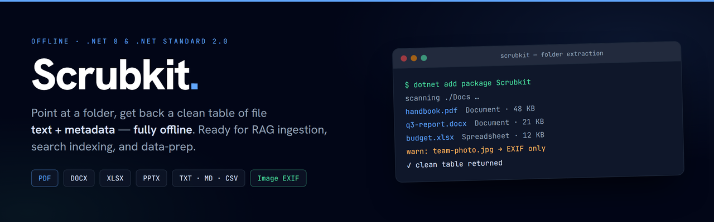

# Scrubkit

**Point at a folder, get a clean table of file text + metadata back — 100% offline.**

Scrubkit walks a directory and extracts text and metadata from common file types (PDF, Word, Excel, PowerPoint, Email, OpenDocument, EPUB, Plain Text, EXIF), returning one row per file.

---

## 📚 Documentation & Ecosystem Portal

Explore complete Scrubkit documentation, integration recipes, and API references on our web portal:

| Resource | Description | Destination Link |
| :--- | :--- | :--- |
| **🌐 Official Website** | Interactive product overview, performance benchmarks, and architecture. | [**Visit Site →**](https://jjopensoftworks-blip.github.io/Scrubkit/) |
| **🤖 RAG & AI Recipes** | End-to-end recipes for `Microsoft.Extensions.AI`, `Semantic Kernel`, vector stores, and Parquet. | [**View RAG Recipes →**](https://jjopensoftworks-blip.github.io/Scrubkit/recipes.html) \| [**Markdown**](docs/RAG-INGESTION-RECIPES.md) |
| **💻 CLI Command Guide** | Zero-code folder scanning via `scrubkit scan`, output formatting, and CI secret scanning. | [**View CLI Guide →**](src/Scrubkit.Tool/README.md) |
| **📦 Package Family** | Full matrix of all 14 Scrubkit packages (`Core`, `Abstractions`, `Pdf`, `Images`, `Email`, `Parquet`, etc.). | [**Explore Packages →**](https://jjopensoftworks-blip.github.io/Scrubkit/#packages) |
| **🧪 Interactive Demo** | Runnable demo console application on synthetic sample files. | [**Run Playground →**](samples/Scrubkit.Playground) |
| **📝 Release History** | Version changelogs, feature additions, and API update notes. | [**View Changelog →**](https://jjopensoftworks-blip.github.io/Scrubkit/changelog.html) |

---

## License & Privacy

- **License:** [Mozilla Public License 2.0 (MPL-2.0)](LICENSE) — open and free to use in open or commercial applications.
- **Privacy:** 100% offline. No network requests or telemetry.
